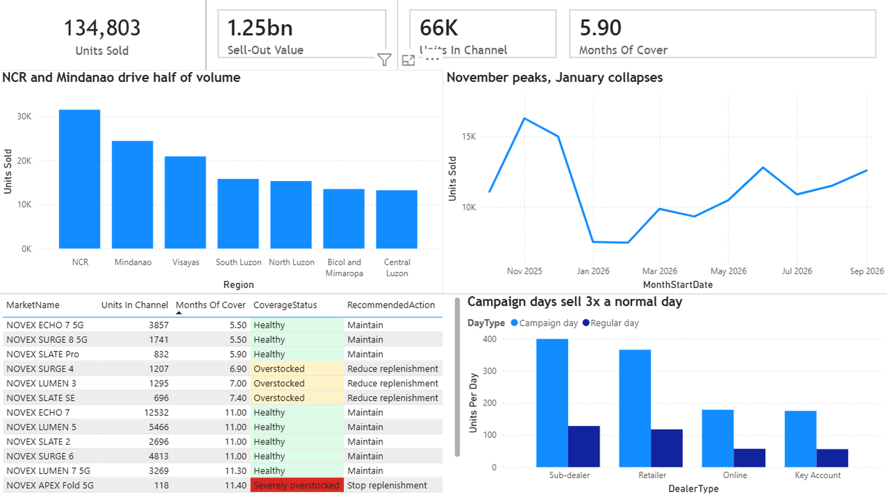
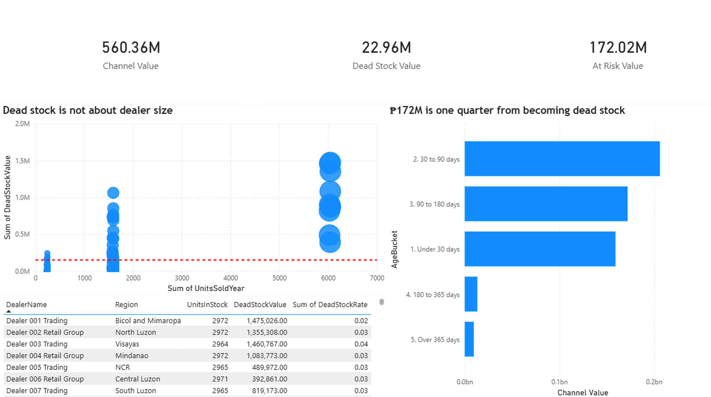

# Channel Analytics

SQL Server data warehouse + Power BI report for a consumer electronics
distributor channel.

The question I built it around: **how much stock is sitting with dealers, how
old is it, and which SKUs should we stop shipping?**



## Why this project

I work with channel data at my job. Brands sell to distributors, distributors
sell to dealers, dealers sell to consumers. Head office can see its own
shipments fine. What it can't see is what happens after that, and that's where
the money gets stuck.

So I rebuilt the problem from scratch with synthetic data. No real company data
here, no real dealer names, no real IMEIs. The structure is modelled on how
these systems actually export (one row per device, sell-out and inventory as
separate extracts) because building against a realistic shape was the point.

## What's in it

- 12 months, Oct 2025 to Sep 2026
- ~134,800 sell-out rows, one per device sold
- ~66,200 inventory rows, one per device sitting in the channel
- 24 SKUs, 150 dealers, 4 distributors

Everything is generated in T-SQL. Set-based, no loops, no `NEWID()`. Random
values come from `dbo.Numbers`, a tally table with six pre-computed
pseudo-random columns, so the same seed always produces the same dataset and I
can actually reproduce a bug.

I also put the intended shape into the dimension tables instead of hiding it in
the generator. `DimProduct.SlotFrom`/`SlotTo` carve 1-1000 into shares of
demand, so you can read the product mix straight off the table.
`AgedSlotFrom`/`AgedSlotTo` do the same for stock over 180 days, weighted
toward end-of-life models.

## Findings

134,803 units sold over the year, ₱1.25bn at SRP. Sitting in the channel:
66,278 units, ₱560M at dealer price.

That works out to **5.9 months of cover**. Almost half a year of stock in a
category where the successor model launches every six months.

The ageing breakdown:

| Age | Units | Value at dealer price |
|---|---:|---:|
| Under 30 days | 19,027 | ₱159.3M |
| 30-90 days | 24,653 | ₱206.1M |
| 90-180 days | 20,546 | ₱172.0M |
| 180-365 days | 1,193 | ₱13.4M |
| Over 365 days | 859 | ₱9.6M |

Dead stock (180+ days) is ₱23.0M. Not nothing, but only 4% of channel value.

The number that actually matters is the one above it. **₱172M, 31% of
everything in the channel, is in the 90-180 day bucket.** It isn't dead yet,
it's one quarter away, and it's seven times bigger than the dead pile it's
about to join.

A report that only flags stock past 180 days is reporting a loss after it
already happened. The 90-day bucket is where you can still do something.

Two other things I noticed:

Average selling price sits between ₱9,286 and ₱9,301 every single month. All
the revenue movement is volume, none of it is mix or price. So the lever is
allocation, not pricing.

77% of dead stock is end-of-life SKUs. The problem isn't that old stock
accumulated everywhere, it's that replenishment kept running on models that
had already been superseded.

## Schema

Eight tables in `dbo`, `Dim`/`Fact` naming, named constraints, audit columns.

```
DimDate ─┐
DimProduct ─┼─→ FactSellOut     (one row per device sold)
DimDealer ─┤
DimDistributor ─┘
                └─→ FactInventory  (one row per device in stock)
```

Money is `DECIMAL`, never `FLOAT`. Float currency gives you values like
`0.10000000149` and quiet drift once you start summing.

Six views on top. Power BI connects to these, never to the tables, so "dead
stock" is defined once in SQL and can't fork between Power BI, Excel and
whatever ad-hoc query someone runs next week.

`vw_SellOutDetail` (device grain, all dims joined), `vw_MonthlySellOut`,
`vw_ProductPerformance`, `vw_InventoryAging`, `vw_ChannelCoverage`,
`vw_DealerScorecard`.

One modelling decision I'll defend: real channel exports tend to shove
geography and sales channel into the same column, so you get `Mindanao` and
`Online` sitting side by side in a field called "region". Makes "how did online
do in Mindanao" unanswerable. I split them. Region is geography, DealerType is
channel.

## Power BI



One relationship in the whole model: `DimDate[FullDate]` to
`vw_SellOutDetail[SellOutDate]`.

Autodetect wanted to build six or seven more, matching on column names. I
deleted them all and switched autodetect off. `vw_MonthlySellOut` is 12 rows.
Relating it to the 134,803-row detail table lets each one filter the other and
the totals quietly stop being right. Aggregated views should sit unrelated.

Twelve measures, all using `DIVIDE` instead of `/` so a zero denominator
returns blank rather than an error.

`Units Per Day` exists because of a trap I walked into. I wanted to compare
campaign-day sales to regular days, but there are only 11 campaign days in 365,
so their total is always smaller no matter how well they do. Dividing by
distinct days makes it fair, and the real effect shows up: campaign days run
about 3x a normal day.

I also tried a median line on the dealer scatter before switching to average.
The median landed at nearly zero, because 110 of the 150 dealers are long-tail
accounts and the middle one barely holds any stock. Technically correct,
completely useless as a reference. Average sits inside the data where you can
use it.

## Verification

Twelve checks in section 6, all passing. A script running without an error and
a script producing correct data are two different things.

The one I'm most attached to is check 7, which counts distinct dealers per SKU.
My first version of the pseudo-random columns used modulus 10000 for all six.
Pairwise correlation came out at 0.0000, which looked fine, so I nearly shipped
it. But every column was a fixed function of the others, and each product only
ever reached **10 of the 150 dealers**. Correlation was the wrong test
entirely. Fixed by giving each column its own prime modulus, and now every SKU
reaches 120+.

Two other bugs worth writing down:

`ABS(DayOfMonth - MonthNumber)` threw Msg 8115. In SQL Server, tinyint minus
tinyint stays tinyint, and tinyint can't go negative, so day 1 minus month 12
overflows before `ABS` ever sees it. Cast to int first.

`PRINT CONCAT('rows: ', (SELECT COUNT(*) ...))` is Msg 1046. Because it's a
compile error it kills the entire batch, so the INSERT above it never ran and
the fact tables came out empty with no obvious cause. Took me a while to find
that one.

## Running it

Open `ChannelAnalytics_FullBuild.sql` in SSMS and hit F5 once. It creates its
own database so nothing else on the server gets touched, and it's safe to
re-run.

Takes a few minutes, mostly the sell-out generation. Each section ends with a
PRINT so the Messages tab tells you how far it got.

```
├─ ChannelAnalytics_FullBuild.sql
├─ ChannelAnalytics_Dashboard.pbix
├─ screenshots/
└─ README.md
```

## What I'd add next

Monthly inventory snapshots instead of the single one. Right now I can measure
aged stock but not track it, so there's no way to tell whether the 90-180 day
bucket is growing or shrinking. That's the obvious gap.
